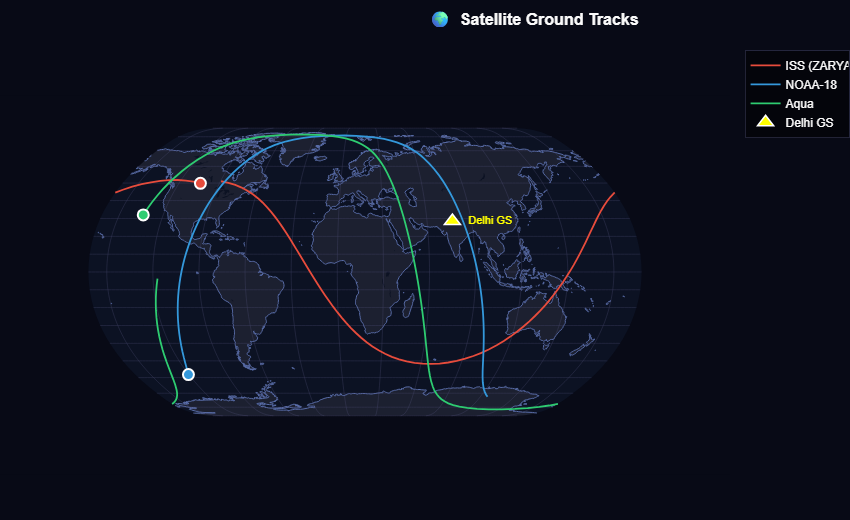
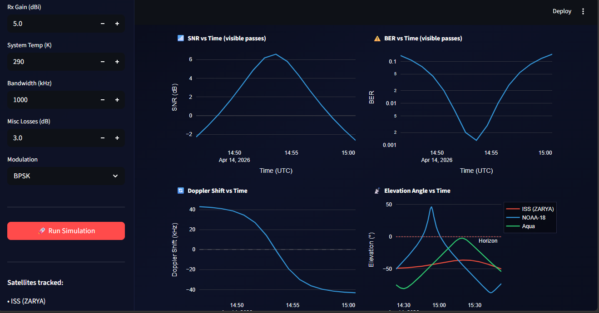

# 🚀 Heliosphere - Satellite Link Budget & Visualization Simulator

## 📌 Overview

Heliosphere is a **satellite communication simulation system** that models link performance between satellites and a ground station. It integrates orbital propagation, RF link budget analysis, and interactive visualization into a unified pipeline.

The system produces **engineering-grade outputs** including Signal-to-Noise Ratio (SNR), Bit Error Rate (BER), Doppler shift, and elevation angle, along with exportable datasets and structured PDF reports.

---

## 🎓 Academic Context

**Author:** Verma Anand  
**Program:** B.Tech (Electronics & Communication Engineering)  
**University:** GGSIPU, New Delhi  

**Basis of Work:**  
This project is a self-implementation based on concepts learned from satellite communication lectures by Prof. A. Al-Hourani (RMIT University, Australia).

Lecture Source:  
https://youtube.com/playlist?list=PLbPW06RB5w6m_xizacLr6dMXP58IHq23D

---

## 🧠 Key Features

- Satellite orbit propagation using SGP4 (via Skyfield)  
- Link budget modeling (FSPL + Friis transmission equation)  
- SNR to BER mapping (BPSK, QPSK)  
- Doppler shift computation using range-rate projection  
- Elevation-based satellite visibility filtering  
- Interactive Streamlit dashboard with Plotly  
- Automated CSV export and PDF report generation  

---

## 🏗️ Architecture

### `core.py`
- Core physics and communication models  
- Vectorized multi-satellite propagation  
- No UI dependencies  

### `app.py`
- Streamlit-based interactive dashboard  
- Plotly visualizations (map + time series)  
- Session state management and exports  

### `report.py`
- Matplotlib figure generation (PNG outputs)  
- ReportLab-based multi-page PDF report  
- Includes equations, plots, and analysis  

### `run_simulation.py`
- CLI interface for headless simulation  
- Parameterized execution  

---

## 📦 Project Structure

```
.
├── core.py
├── app.py
├── report.py
├── run_simulation.py
├── requirements.txt
├── README.md
├── .gitignore
└── outputs/
    ├── data/
    └── plots/
```

---

## 🚀 Getting Started

### 1. Install dependencies
```bash
pip install -r requirements.txt
```

### 2. Run interactive dashboard
```bash
streamlit run app.py
```

### 3. Run CLI simulation
```bash
python run_simulation.py --duration 90 --modulation BPSK --freq 2.0
```

---

## 📡 Technical Concepts Implemented

- Friis Transmission Equation  
- Free Space Path Loss (FSPL)  
- Digital modulation (BPSK, QPSK)  
- Bit Error Rate (BER) modeling  
- Doppler shift in satellite communication  
- Orbital propagation using SGP4  

---

## 📈 Outputs

- Interactive visualization dashboard  
- CSV datasets for analysis  
- High-resolution plots (PNG)  
- Structured technical PDF report  

## 📸 Screenshots


<p align="center">
  
</p>

<p align="center">
  
</p>

---

## ⚠️ Disclaimer

This project is an independent implementation for academic and learning purposes.  
It is not affiliated with or endorsed by RMIT University or Prof. A. Al-Hourani.

---

## 📬 Contributions

Contributions are welcome in:
- Advanced channel modeling (rain attenuation, atmospheric loss)  
- Additional modulation schemes  
- Real-time TLE data integration  
- Performance and scalability improvements  

---

## 📄 License

MIT License
